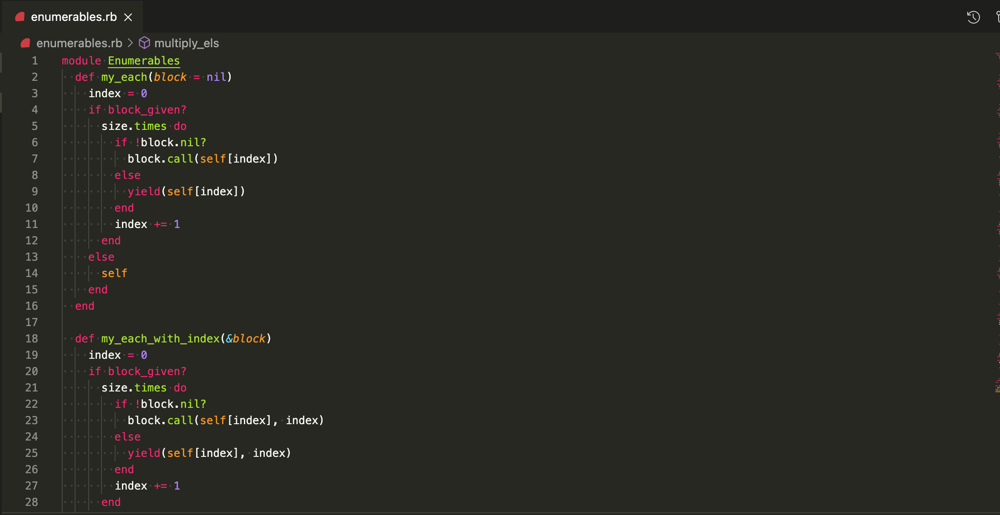

# Enumerables
In this project, we have implemented our version of Ruby’s enumerable methods.

## Enumerable Methods List:

- my_each
- my_each_with_index
- my_select
- my_all?
- my_any?
- my_none?
- my_count
- my_map
- my_inject
- multiply_els



## Built With Ruby


## Dependecies

- Ruby 3.0 (or higher)

## Run Program

__Clone the repo to your local machine using the terminal__:
```
$ git clone https://github.com/juxsalley/enumerables.git
```

1. Navigate into the project directory 
   - `cd enumerables`
   - ``cd lib``
2. Run the project `ruby enumerables.rb`

## Run Tests

- After cloning repo run ```bundle install``` to install gems
- ```bundle exec rspec``` to run test.


## Author

### Author 

👤 **Salley**

- GitHub: [@JuxSalley](https://github.com/juxsalley)
- Twitter: [__salley](https://twitter.com/__salley)
- LinkedIn: [Iddrisu salley](https://www.linkedin.com/in/dev-salley/)


## Contributing

Contributions, issues, and feature requests are welcome!

Feel free to check the [issues page](https://github.com/CacheMeGifYouCan/Enumerables-Project/issues)

## 📝 License

This project is [MIT](LICENSE) licensed.
